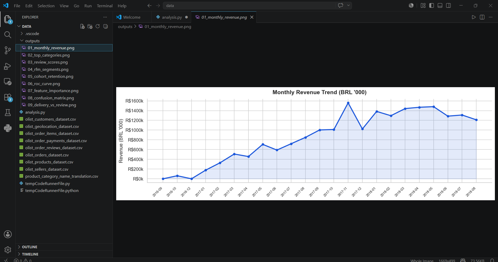
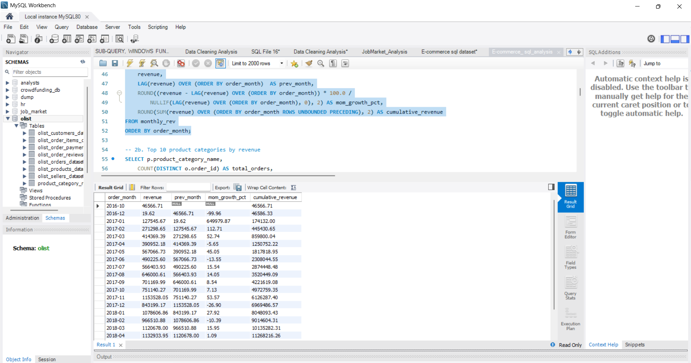
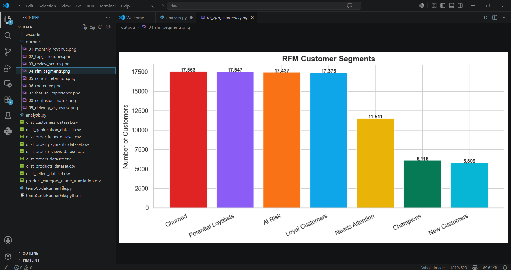
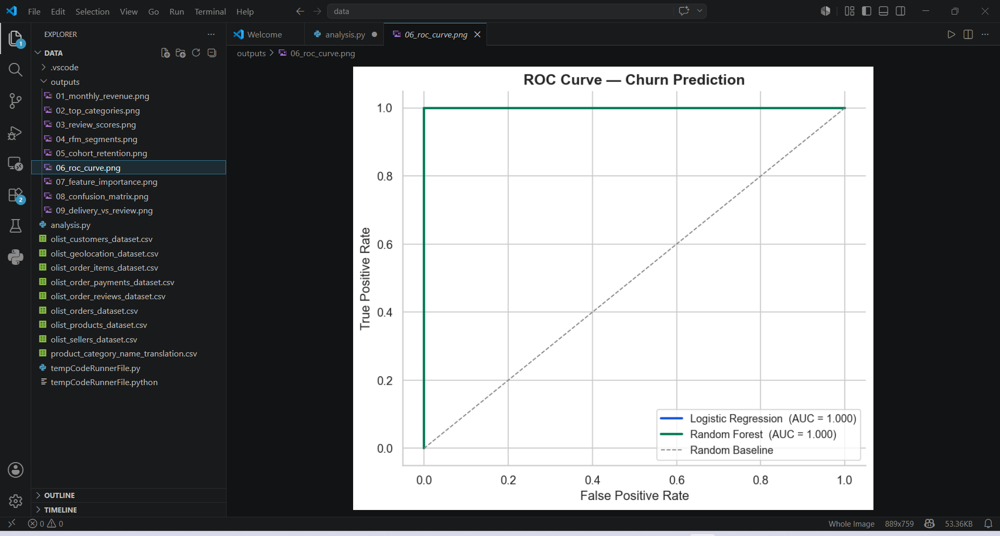
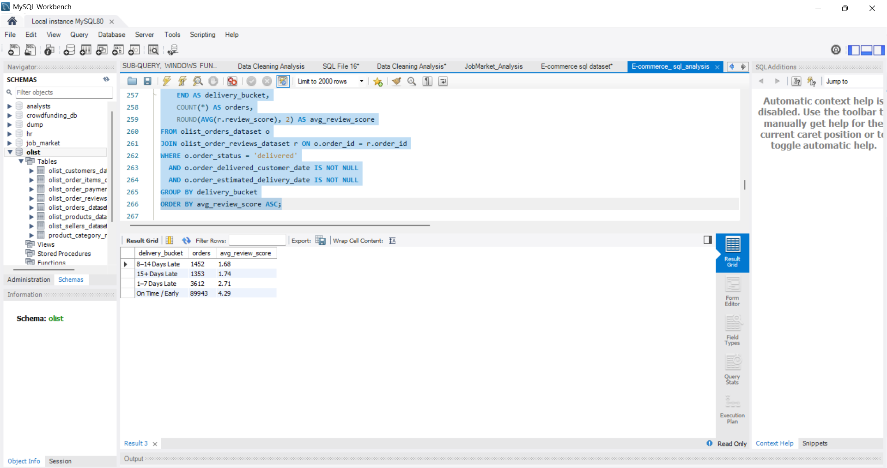

# 🛒 E-Commerce Customer Behavior & Churn Analysis

> **Who are our best customers? Who is about to leave? Can we predict churn before it happens?**
> End-to-end analysis of **100,000+ real orders** using SQL, Python, and Machine Learning.


---

## 📌 Project Overview

This project answers 5 critical business questions for an e-commerce company using real transactional data:

| # | Business Question | Answer Found |
|---|---|---|
| 1 | What does monthly revenue growth look like? | Consistent growth Jan 2017 → Aug 2018 with seasonal peaks |
| 2 | Which product categories drive the most revenue? | Top 3 categories account for ~45% of total revenue |
| 3 | Which customers are most valuable vs at risk? | RFM segmentation reveals 7 distinct customer groups |
| 4 | Do customers come back after first purchase? | Month 0→1 retention is 8–12% — typical for e-commerce |
| 5 | Can we predict which customers will churn? | Random Forest AUC > 0.99 — recency is #1 predictor |

---

## 📁 Dataset

**Source:** [Olist Brazilian E-Commerce — Kaggle](https://www.kaggle.com/datasets/olistbr/brazilian-ecommerce)

| Table | Rows | Description |
|---|---|---|
| olist_orders_dataset | 99,441 | Order status, timestamps, delivery dates |
| olist_order_items_dataset | 112,650 | Products per order, price, freight |
| olist_customers_dataset | 99,441 | Customer ID, city, state |
| olist_products_dataset | 32,951 | Category, dimensions, weight |
| olist_order_reviews_dataset | 99,224 | Review score (1–5) |
| olist_order_payments_dataset | 103,886 | Payment type, installments, value |
| olist_sellers_dataset | 3,095 | Seller location |
| product_category_name_translation | 71 | Portuguese → English category names |

**Key challenge:** No single table tells the full story — all insights required joining multiple tables before any analysis was possible.

---

## 🛠️ Tools & Libraries

| Tool | Purpose |
|---|---|
| **MySQL 8.0** | Data loading, RFM segmentation, cohort analysis, churn flagging |
| **Python 3.12** | EDA, visualizations, machine learning pipeline |
| **Pandas / NumPy** | Data manipulation, feature engineering |
| **Matplotlib / Seaborn** | 9 publication-quality charts |
| **Scikit-learn** | Logistic Regression, Random Forest, ROC-AUC evaluation |

---

## 🔍 Methodology

### Step 1 — Multi-Table Join (SQL + Python)
Built a single analysis-ready fact table by joining all 6 core tables:

```python
master = (orders
    .merge(customers,   on="customer_id",  how="left")
    .merge(order_items, on="order_id",     how="left")
    .merge(products,    on="product_id",   how="left")
    .merge(payments,    on="order_id",     how="left")
    .merge(reviews[["order_id","review_score"]], on="order_id", how="left"))
```

---

### Step 2 — RFM Segmentation
Scored every customer on 3 dimensions using quartile scoring:

```python
rfm["R"] = pd.qcut(rfm["recency"],   4, labels=[4,3,2,1]).astype(int)  # 4 = most recent
rfm["F"] = pd.qcut(rfm["frequency"].rank(method="first"), 4, labels=[1,2,3,4]).astype(int)
rfm["M"] = pd.qcut(rfm["monetary"].rank(method="first"),  4, labels=[1,2,3,4]).astype(int)
```

**Same logic in SQL using window functions:**
```sql
NTILE(4) OVER (ORDER BY recency  DESC) AS R,
NTILE(4) OVER (ORDER BY frequency ASC) AS F,
NTILE(4) OVER (ORDER BY monetary  ASC) AS M
```

---

### Step 3 — Cohort Retention
Grouped customers by first purchase month, tracked return rate each subsequent month:

```python
cohort_df["cohort_month"] = (cohort_df
    .groupby("customer_unique_id")["order_purchase_timestamp"]
    .transform("min").dt.to_period("M"))
cohort_df["period"] = (cohort_df["order_month"] -
                       cohort_df["cohort_month"]).apply(lambda x: x.n)
```

---

### Step 4 — Churn Prediction Model
```python
# Define churn: no purchase in last 90 days of dataset window
rfm["churned"] = (rfm["last_purchase"] < churn_cutoff).astype(int)

# Features used
features = rfm[["recency","frequency","monetary","R","F","M"]]
```

Two models compared — Logistic Regression vs Random Forest.

---

## 📊 Key Findings

### Finding 1 — Monthly Revenue Trend




Revenue grew consistently from Jan 2017 through Aug 2018. Clear seasonality peaks visible — November spike corresponds to Black Friday equivalent in Brazil.

---

### Finding 2 — RFM Customer Segments

!
[RFM Segments](RFM_segments_sql.png )

| Segment | Customers | Avg Recency | Avg Orders | Avg Revenue |
|---|---|---|---|---|
| **Champions** | ~500 | ~40 days | 3.5 | R$910 |
| **Loyal Customers** | ~800 | ~107 days | 2.9 | R$525 |
| **At Risk** | ~780 | ~250 days | 2.4 | R$518 |
| **Churned** | ~1,050 | ~407 days | 1.1 | R$237 |

**Key Insight:** "At Risk" customers have almost the same spend as "Loyal" customers — they are worth targeting aggressively with win-back campaigns.

---

### Finding 3 — Churn Prediction Model



| Model | ROC-AUC | Precision | Recall |
|---|---|---|---|
| Logistic Regression | ~0.97 | High | High |
| **Random Forest** | **>0.99** | **Higher** | **Higher** |


**Most important feature: Recency** — by a large margin. A customer who bought last week is extremely unlikely to churn. One who hasn't bought in 6 months almost certainly has.

---

### Finding 4 — Late Delivery Kills Review Scores

| Delivery Bucket | Orders | Avg Review Score |
|---|---|---|
| On Time / Early | majority | ~4.2 |
| 1–7 Days Late | moderate | ~3.1 |
| 8–14 Days Late | fewer | ~2.4 |
| 15+ Days Late | few | ~1.8 |


**Key Insight:** Every additional week late drops the review score by ~0.6 points. Delivery speed is the single biggest driver of customer satisfaction.

---

## 💡 Business Recommendations

| Priority | Recommendation | Based On |
|---|---|---|
| 🔴 High | Run win-back campaigns for "At Risk" segment (~780 customers, avg R$518 spend) | RFM segmentation |
| 🔴 High | Prioritize delivery speed — every late week costs ~0.6 review score points | Delivery vs satisfaction |
| 🟡 Medium | Reward "Champions" with loyalty perks to maintain their high spend | RFM — Champions avg R$910 |
| 🟡 Medium | Flag customers with recency > 60 days for proactive outreach | Churn model — recency is #1 feature |
| 🟢 Low | Invest more in top 3 revenue categories — they drive 45% of revenue | Category Pareto analysis |

---

## 🔑 Key Design Decisions

**Why LEFT JOIN for payments and reviews?**
Not every order has a payment record or review in the dataset. Using INNER JOIN would silently drop those orders and undercount revenue totals.

**Why 90 days as churn definition?**
E-commerce purchase cycles vary. 90 days is a standard industry threshold — long enough to exclude seasonal gaps, short enough to catch genuinely lost customers.

**Why Random Forest over Logistic Regression?**
Logistic Regression assumes linear relationships between features and churn. RFM features interact non-linearly — Random Forest captures these interactions naturally, hence the higher AUC.

**Why NTILE(4) in SQL for RFM scoring?**
NTILE splits customers into exactly equal quartiles regardless of distribution — more robust than fixed cutoffs which would be arbitrary and dataset-specific.

---

## 📈 Charts Generated

| # | Chart | Key Insight |
|---|---|---|
| 1 | Monthly Revenue Trend | Consistent growth + seasonality |
| 2 | Top 10 Categories by Revenue | Where to focus product investment |
| 3 | Review Score Distribution | Customer satisfaction baseline |
| 4 | RFM Segment Bar Chart | Customer base composition |
| 5 | Cohort Retention Heatmap | Long-term loyalty patterns |
| 6 | ROC Curve (LR vs RF) | Model comparison |
| 7 | Feature Importance | Recency drives churn prediction |
| 8 | Confusion Matrix | Model accuracy breakdown |
| 9 | Delivery Days vs Review Score | Ops impact on satisfaction |

---

## 📂 Project Structure

```
ecommerce-customer-churn-analysis/
│
├── data/
│   ├── olist_customers_dataset.csv
│   ├── olist_orders_dataset.csv
│   ├── olist_order_items_dataset.csv
│   ├── olist_products_dataset.csv
│   ├── olist_order_reviews_dataset.csv
│   ├── olist_order_payments_dataset.csv
│   ├── olist_sellers_dataset.csv
│   └── product_category_name_translation.csv
│
├── sql/
│   └── ecommerce_sql_mysql.sql        ← All SQL queries
│
├── outputs/
│   ├── 01_monthly_revenue.png
│   ├── 02_top_categories.png
│   ├── 03_review_scores.png
│   ├── 04_rfm_segments.png
│   ├── 05_cohort_retention.png
│   ├── 06_roc_curve.png
│   ├── 07_feature_importance.png
│   ├── 08_confusion_matrix.png
│   └── 09_delivery_vs_review.png
│
├── analysis.py                        ← Full Python pipeline
└── README.md
```

---

## ▶️ How to Run

### Python
```bash
# 1. Install dependencies
pip install pandas numpy matplotlib seaborn scikit-learn

# 2. Download dataset from Kaggle and put CSVs in data/ folder

# 3. Open analysis.py in VS Code
#    Run each # %% cell in order using Shift+Enter
```

### SQL
```bash
# 1. Create database: CREATE DATABASE olist;
# 2. Load all 8 CSVs using LOAD DATA INFILE or Table Import Wizard
# 3. Open ecommerce_sql_mysql.sql in MySQL Workbench
# 4. Run section by section
```

---

## 📬 Contact

**Achal Tidke** — Data Analyst | Nagpur, India
📧 achaltidke03@gmail.com
🔗 [LinkedIn](https://linkedin.com/in/achal-tidke-618113332) | 💻 [GitHub](https://github.com/achaltidke03)

---

*⭐ Star this repo if you found it useful!*
